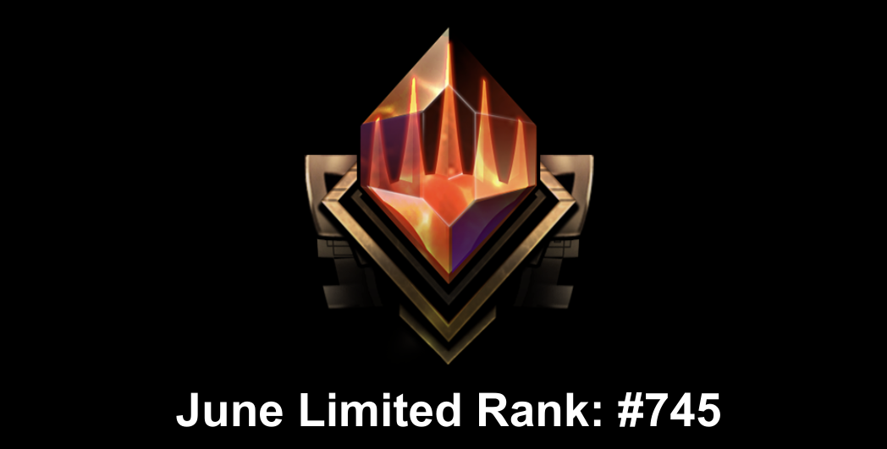

# 202506

6月はFFドラフトでMythicになり、なんかいい感じの順位で終わっていた。

FFドラフトはテンポ環境で、プレイアブルなカードが多くて楽しかった。

## FIN強かったカード

### コモン

- Gaelicat
  - 飛行が通るのでつよい
- Combat Tutorial
  - おまけでカウンターが乗るカードを強く使うために2マナで生物出したいみたいなところもある
- Sephiroth's Intervention
- Call the Mountain Chocobo
  - 4マナ以上スペルのシナジーがあり、土地を伸ばす効果もシナジーと噛み合い気持ちよくなれる
- Town Greeter

### アンコモン

- Dragoon's Lance
- Il Mheg Pixie
- Overkill
- Choco-Comet
- Summon: Fenrir
  - イカれているとしか言いようがない圧倒的トップアンコモン
- Shantotto, Tactician Magician

# 202608

7月は全くやっていなくて、8月EOEリリース後から再開した。

EOEはFFと違ってミッドレンジ〜コントロール環境で、スクリューは即死するものの、フラッド受けは少ないので運ゲー感が強い。

除去は多いので除去とちゃんと強いカードをピックするのが比較的よさそうな気はする。

フラッドとスクリューでかなり負けたけど一応瞬間400位くらいでMythicに到達したので一旦終わり。
最終1200位に入れそうならもうちょっとやるかもという感じ。

ショックランドが出るのでジェムなくなるまでやってもいいかなと思っていたけど、事故のストレスに耐えられないのでやめておく。

## EOE強かったカード

### コモン

- Banishing Light
- Cryogen Relic
  - 分割4マナ2ドローでも悪くないのにアーティファクトシナジーありおまけ効果ありで隙がない
- Gravpack Monoist
- Melded Moxite
  - スクリュー受け+フラッド受け+アーティファクトシナジー
- Galactic Wayfarer
- Pinnacle Kill-Ship
  - わりと簡単に生物になる上、生物として強すぎる

### アンコモン

- Starfield Shepherd
  - 白はアグロよりなのでこういうカードが取れたら土地16にしたい
- Tractor Beam
  - サクられない、サクれる、セルフバウンスされない、能力を有効活用できるという点で偉い
- Faller's Faithful
  - コモンに相性がいいカードが多い 適当にサクって引くだけでも強い
- Terrapack Intimidator
  - 強いていうならという感じ 赤のアンコは質が低め
- Glacier Godmaw
- Biomechan Engineer
