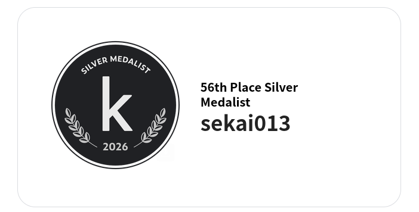

# Kaggriculture

https://www.kaggle.com/competitions/kaggriculture

1日24Stepを30日繰り返す農業シミュレーションゲーム

見始めたのが9月の頭くらい

まずはコンペティションとゲームのルールを読んでなんとなく理解

当時のリーダーボードトップのリプレイを見て、ボードゲーマー的見地からぬるいと感じたのでいけそうな気がして取り組み始める

第一印象は

- 1Stepで人数分のワーカーアクション+最大10個の注文アクションで、アクションスペースが膨大なのでぱっと見強化学習は難しそう

- 実行環境と1アクション1秒+タイムバンク60秒から時間内に複雑な探索をするのも難しそう

という感じ

公開Notebookを見るとゲーム終了までのアクションを固定化したテープを作り、Shopなどの条件でルーティングさせるという感じになっていて

ひどいものは相手のDay0終了時の盤面がこれだったら分岐する、みたいな公開Notebook同士の醜い争いが繰り広げられていた

既存のNotebookはぬるいと思っていたので1から新しいテープを作り始める

同時に自分のテープと盤面に応じて注文アクションを動的に生成するPlannerを作り始める

相手に先に売られない限りはなるべく売らずに持っているほうが得というところを実現するため

固定テープのルーティングは提出して目立つとすぐに中身がバレそうだったので、しばらく提出もせず黙々と固定テープの改善をやっていたのだけど、

テープを作るのにいちいちVRPやCP-SATを解くのがつらいし、複数パターンのポートフォリオを試すのも大変なので、強化学習に移行したいけど、いい感じのモデルが思いつかないまま2週間くらい経ち、

LB上位が明らかに固定テープ+ルーティングではない感じになってきて、このあたりで終戦感が漂ってくる

なんかないかを考えた結果、残り1週間くらいで、ワーカーをどう動かすかという部分を省いたポートフォリオだけを学習させるのは結構簡単なのでは？と思いつき

ポートフォリオだけのミニゲームを定義して学習し、それに応じてテープをオフラインで頑張って作り、ルーティングも学習するという感じで進めていくが、やっぱりテープ作る部分が重すぎて断念

最終的にはテープ作成部分をLB上位のリプレイに依存して、ビームサーチでルート選択、注文アクションは前作ったPlannerに任せるという感じの枠組みで、細かいテープの調整をしたりして提出し暫定10246チーム中80位くらいの銀という感じ

画像はコンペティションが終わった直後に不具合か何かで銀おめでとうメールが来ていたもの

終了から2週間は順位確定しないはずなのでこれは何？

ポートフォリオだけの学習をするのはいい案だと思ったけど、そこから先に進めなかったのが残念だった

ポートフォリオが出せればその日の必要アクションはわかるので、必要なアクションを全部実行するモデルを別で学習させればよかったと思う

第一印象で全部やる巨大なモデルを作るのは厳しそうに思えたけど、ポートフォリオ、ワーカーアクション、注文に分ければそれぞれを学習させるのは全然可能だった

Kaggle は今までやりたいと思いながらもやれておらず、今回初めてやってみたけど、
特に自分が好きなボードゲームチックな題材ということもあり面白かった
Simulationコンペがあればまた出たい
