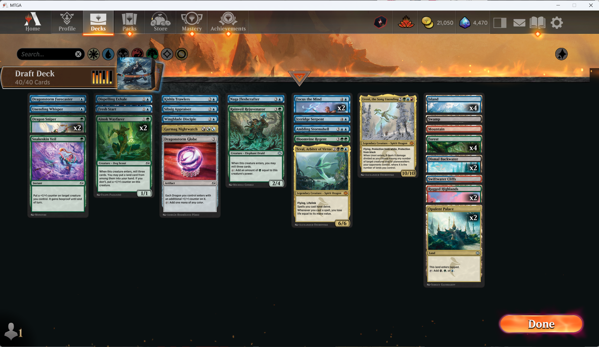

UGbrで7-1

3-2で緑ドラゴンとスゥルタイ生物回収どっち取るか悩んでドラゴンとってしまったけど多分生物回収だった

負けた試合は次勝ちのところで3/5接死ドラゴン引かれて緑ドラゴンがビタ止まりしてグダり
Ureni出したらhexproof→-5/-0→格闘で処理されてそのままTevalとお見合いしてライブラリアウト負け

ハイライトはクローン起動亀6体パンチの18枚ドロー

detailed logが残ってなかったので設定をonにした
