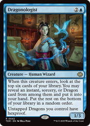
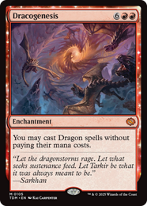

プレリの勝率上げたいと言っている人が点数つける配信見てたら自分と全然違ってて面白かったのでつけてみる

途中で飽きたので単色だけ

- 最低1
- 最高10
- 4: デッキに入れたくない
- 5: デッキに入れてもいい 
- 6: デッキに入れたい

# White
## Anafenza, Unyielding Lineage 7

## Arashin Sunshield 4

## Bearer of Glory 5

## Clarion Conqueror 7

## Coordinated Maneuver 5

## Dalkovan Packbeasts 5

## Descendant of Storms 6

## Dragonback Lancer 6

## Duty Beyond Death 5

## Elspeth, Storm Slayer 9

## Fortress Kin-Guard 6

## Furious Forebear 4

## Lightfoot Technique 5

## Loxodon Battle Priest 7

## Mardu Devotee 4

## Osseous Exhale 6

## Poised Practitioner 4

## Rally the Monastery 5

## Rebellious Strike 3

## Riling Dawnbreaker // Signaling Roar 6

## Sage of the Skies 7

## Salt Road Packbeast 6

## Smile at Death 4

## Starry-Eyed Skyrider 5

## Static Snare 6

## Stormbeacon Blade 5

## Stormplain Detainment 6

## Sunpearl Kirin 7

## Teeming Dragonstorm 5

## Tempest Hawk 4

## Twinmaw Stormbrood // Charring Bite 7

## United Battlefront 1

## Voice of Victory 7

## Wayspeaker Bodyguard 6

# Blue
## Aegis Sculptor 6

## Ambling Stormshell 7

## Bewildering Blizzard 4

## Constrictor Sage 5

## Dirgur Island Dragon // Skimming Strike 5

## Dispelling Exhale 5

## Dragonologist x

あまりにプール次第すぎる

## Dragonstorm Forecaster 3

## Essence Anchor 4

## Focus the Mind 4

## Fresh Start 6

## Highspire Bell-Ringer 4

## Humbling Elder 4

## Iceridge Serpent 4

## Kishla Trawlers 6

## Marang River Regent // Coil and Catch 8

## Naga Fleshcrafter 5

## Ringing Strike Mastery 5

## Riverwalk Technique 4

## Roiling Dragonstorm 5

## Sibsig Appraiser 5

## Snowmelt Stag 4

## Spectral Denial 4

## Stillness in Motion 1

## Taigam, Master Opportunist 6

## Temur Devotee 5

## Unending Whisper 5

## Ureni's Rebuff 4

## Veteran Ice Climber 5

## Whirlwing Stormbrood // Dynamic Soar 6

## Wingblade Disciple 6

## Wingspan Stride 5

## Winternight Stories 5

# Black

## Abzan Devotee 4

## Adorned Crocodile 4

## Aggressive Negotiations 3

## Alchemist's Assistant 6

## Alesha's Legacy 5

## Avenger of the Fallen 6

## Caustic Exhale 6

## Corroding Dragonstorm 4

## Cruel Truths 5

## Delta Bloodflies 4

## Desperate Measures 6

## Dragon's Prey 6

## Feral Deathgorger // Dusk Sight 4

## Gurmag Rakshasa 6

## Hundred-Battle Veteran 4

## Kin-Tree Nurturer 5

## Krumar Initiate 5

## Nightblade Brigade 4

## Purging Stormbrood // Absorb Essence 6

## Qarsi Revenant 8

## Rot-Curse Rakshasa 3

## Salt Road Skirmish 6

## Sandskitter Outrider 5

## Scavenger Regent // Exude Toxin 8

## Sidisi, Regent of the Mire 5

## Sinkhole Surveyor 7

## Strategic Betrayal 4

## The Sibsig Ceremony 1

## Unburied Earthcarver 5

## Unrooted Ancestor 5

## Venerated Stormsinger 6

## Wail of War 6

## Worthy Cost 4

## Yathan Tombguard 6

# Red

## Breaching Dragonstorm 1

## Channeled Dragonfire 6

## Cori-Steel Cutter 7

## Devoted Duelist 5

## Dracogenesis 1

## Equilibrium Adept 6

## Fire-Rim Form 5

## Fleeting Effigy 5

## Iridescent Tiger 4

## Jeskai Devotee 5

## Magmatic Hellkite 7

6でいいかも

## Meticulous Artisan 5

## Molten Exhale 6

## Narset's Rebuke 5

## Overwhelming Surge 5

## Rescue Leopard 4

## Reverberating Summons 3

## Runescale Stormbrood 5

## Sarkhan, Dragon Ascendant 5

## Seize Opportunity 5

## Shock Brigade 5

## Shocking Sharpshooter 6

## Stadium Headliner 7

## Stormscale Scion 4

## Stormshriek Feral 5

## Summit Intimidator 5

## Sunset Strikemaster 6

## Tersa Lightshatter 7

## Twin Bolt 5

## Underfoot Underdogs 4

## Unsparing Boltcaster 6

## War Effort 6

## Wild Ride 3

## Zurgo's Vanguard 6

# Green

## Ainok Wayfarer 6

## Attuned Hunter 6

## Bloomvine Regent 7

## Champion of Dusan 5

## Craterhoof Behemoth 8

## Disruptive Stormbrood 6

## Dragonbroods' Relic 4

## Dragon Sniper 6

## Dusyut Earthcarver 5

## Encroaching Dragonstorm 5

## Formation Breaker 6

## Herd Heirloom 5

## Heritage Reclamation 4

## Inspirited Vanguard 6

## Knockout Maneuver 6

## Krotiq Nestguard 5

## Lasyd Prowler 7

## Nature's Rhythm 1

## Piercing Exhale 6

## Rainveil Rejuvenator 5

## Rite of Renewal 4

## Roamer's Routine 5

## Sage of the Fang 6

## Sagu Pummeler 6

## Sagu Wildling // Roost Seek 6

## Sarkhan's Resolve 5

## Snakeskin Veil 5

## Sultai Devotee 5

## Surrak, Elusive Hunter 7

## Synchronized Charge 6

## Trade Route Envoy 6

## Traveling Botanist 6

## Undergrowth Leopard 5

## Warden of the Grove 7

# 感想

- 緑白が強そう
- カードに点数つけても勝率は上がらないと思う

# note

This article is unofficial Fan Content permitted under the Fan Content Policy. Not approved/endorsed by Wizards. Portions of the materials used are property of Wizards of the Coast. ©Wizards of the Coast LLC.
